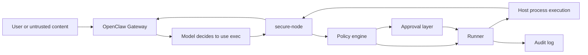

# secure-node Design

## Summary

`secure-node` is a standalone OpenClaw-compatible node host that sits below the model and above the real execution environment.

Its job is simple:

- OpenClaw decides what it wants to do.
- `secure-node` decides whether that action is allowed, whether it requires approval, and where it should run.

The current implementation is an MVP focused on `system.run`, `system.which`, and local `exec approvals` compatibility. The project is intentionally narrow: it does not replace Gateway, agent planning, or the broader OpenClaw tool system. It acts as a hardened execution broker.

## Problem Statement

OpenClaw's strongest risks come from execution, not reasoning:

- An agent can be induced to run dangerous commands.
- Shared high-permission execution environments dramatically increase blast radius.
- Prompt injection is hard to solve at the prompt layer and needs hard runtime boundaries.

The project exists to reduce blast radius by moving command execution behind a policy-enforced boundary.

## Goals

- Provide a drop-in execution boundary for OpenClaw `host=node` flows.
- Preserve the existing OpenClaw mental model: Gateway plans, node executes.
- Enforce local policy before command execution.
- Support local operator approvals and persistent allowlists.
- Keep the first version dependency-light and easy to audit.
- Stay close enough to official protocol and approvals semantics to support real-world Gateway integration.

## Non-Goals

- Rebuilding OpenClaw Gateway.
- Implementing a full hostile multi-tenant security model.
- Providing a browser sandbox or browser proxy in the MVP.
- Providing complete parity with all advanced `exec` modes such as PTY, background jobs, and stream relays.
- Replacing container/VM isolation; the MVP is a control plane for that future layer, not the isolation layer itself.

## Design Principles

1. Minimize trust in the execution surface.
2. Keep the protocol layer thin and isolated from policy logic.
3. Prefer deny-by-default behavior.
4. Make operator review explicit and auditable.
5. Keep the wire format adaptable because protocol compatibility is the highest integration risk.

## System Context

## High-Level Architecture

The system is split into small modules with clear responsibilities.

### CLI

Files:

- `bin/secure-node.js`
- `src/cli.js`

Responsibilities:

- Parse subcommands.
- Load config for inspection or runtime.
- Start the long-running node service.

Current commands:

- `run`
- `print-config`
- `help`

### Config Loader

File:

- `src/config.js`

Responsibilities:

- Merge default config with user-provided JSON.
- Resolve relative paths against the config file directory.
- Expand `~` and normalize storage paths.
- Source gateway token from config or environment.

Key design choice:

- The config format is plain JSON to keep the MVP dependency-free.

### Identity Manager

File:

- `src/identity.js`

Responsibilities:

- Generate and persist an Ed25519 device identity.
- Derive a stable node/device id from the public key.
- Cache the issued device token after successful connection.
- Produce signed device material for the Gateway handshake.

Key design choice:

- Identity is local and durable. The node should feel like a persistent device, not a fresh anonymous process on every boot.

### Protocol Client

File:

- `src/protocol-client.js`

Responsibilities:

- Open and maintain the Gateway WebSocket connection.
- Handle the initial challenge and `connect` request.
- Normalize frame parsing across protocol variants.
- Dispatch inbound requests and events.
- Return execution results back to Gateway.

Current compatibility strategy:

- Accept both `type` and legacy `t` frame markers.
- Accept both `payload`, `params`, and `result`-like response shapes.
- Wait for either `connect.challenge` or legacy-style `session.welcome` before sending `connect`.

Important note:

- This layer is the part most likely to need iteration during real Gateway integration. Some wire details have been aligned to official docs, but live verification against a real OpenClaw Gateway is still required.

### Node Host Service

File:

- `src/node-host.js`

Responsibilities:

- Compose config, identity, approvals, audit, protocol, and execution.
- Register supported commands.
- Route direct calls and `node.invoke` calls into the command handlers.
- Reconnect after connection failures.

This is the application coordinator, not the security engine itself.

### Policy Engine

File:

- `src/policy.js`

Responsibilities:

- Evaluate static policy rules against the normalized execution plan.
- Enforce `allowShellText`.
- Deny access to disallowed working directories or arguments touching protected paths.
- Match configured command rules using binary patterns, `argvIncludes`, shell requirements, and cwd patterns.

Decision model:

- `allow`
- `ask`
- `deny`

The policy layer is intended to answer, "Should this kind of command be allowed at all?"

### Approvals Store

File:

- `src/approvals-store.js`

Responsibilities:

- Read and write local `exec-approvals.json` snapshots.
- Expose `getSnapshot` and `setSnapshot` for OpenClaw compatibility.
- Evaluate agent-specific allowlist decisions.
- Persist one-click operator approvals back into the allowlist.

Decision model:

- `allow`
- `ask`
- `deny`

The approvals layer answers, "Given this operator-managed trust file, should this specific binary be allowed for this agent?"

### Local Approver

File:

- `src/prompt.js`

Responsibilities:

- Prompt the operator in TTY mode when a decision requires approval.
- Serialize prompts so concurrent approvals do not corrupt terminal UX.
- Support `allow once`, `allow and remember`, or `deny`.

Key design choice:

- The MVP keeps approval local to the execution host rather than building a remote UI first.

### Runner

File:

- `src/runner.js`

Responsibilities:

- Normalize raw command input into a safe execution plan.
- Convert shell text into an explicit shell invocation when enabled.
- Sanitize environment variables.
- Resolve binaries.
- Spawn child processes.
- Enforce timeouts.
- Capture and truncate output.

Key security behavior:

- Environment variables are denylisted by prefix and allowlisted by name/pattern.
- Shell text is disabled by default.
- Output is bounded.

### Audit Logger

File:

- `src/audit.js`

Responsibilities:

- Write append-only JSONL records for connection, decision, and execution events.

## Request Lifecycle

### 1. Startup

1. CLI loads config.
2. Service ensures storage directories exist.
3. Identity is loaded or generated.
4. Approvals store and audit logger are initialized.
5. Protocol client connects to Gateway.

### 2. Gateway Handshake

1. WebSocket opens.
2. Node waits for a challenge event.
3. Node sends `connect` with:
   - protocol version bounds
   - client metadata
   - role metadata
   - signed device payload
   - token auth if available
4. If Gateway returns a device token, the node persists it locally.

### 3. `system.run`

1. Request arrives from Gateway.
2. `normalizeRunPlan` builds a canonical execution plan.
3. Policy engine evaluates static rules.
4. Approvals store evaluates operator-managed allowlists.
5. Decisions are combined with deny winning over ask, and ask winning over allow.
6. If the result is `ask`, the local approver prompts the operator.
7. If allowed, the runner executes the command.
8. Result is logged and returned.

### 4. `system.which`

1. Request arrives.
2. Each requested command is resolved against `PATH` or the provided absolute/relative path.
3. The resolution map is returned.

### 5. `system.execApprovals.get` and `.set`

1. Gateway or CLI requests the approval snapshot.
2. Node returns a hash plus file contents.
3. Updates are guarded by hash checks to avoid stomping concurrent edits.

## Decision Composition

The runtime uses two independent decision sources:

- Policy rules
- Approval rules

Combination logic is intentionally conservative:

- Any `deny` wins.
- Otherwise any `ask` wins.
- Only `allow + allow` becomes execution.

This prevents an approval allowlist from bypassing a hard policy deny.

## Data Model

### Runtime Config

Main sections:

- `gateway`
- `node`
- `storage`
- `approvals`
- `policy`
- `runner`
- `audit`

Notable fields:

- `gateway.url`: WebSocket endpoint for Gateway.
- `storage.dir`: local durable state directory.
- `approvals.path`: local approval file path.
- `policy.defaultAction`: default decision when no rule matches.
- `policy.allowShellText`: whether shell strings are allowed.
- `policy.denyPaths`: sensitive path patterns.
- `policy.commandRules`: explicit matching rules.

### Approval Snapshot

The approval file is designed to be compatible in shape with OpenClaw-style exec approval workflows.

Top-level fields:

- `version`
- `socket`
- `defaults`
- `agents`

Per-agent fields:

- `security`
- `ask`
- `askFallback`
- `autoAllowSkills`
- `allowlist`

Allowlist entries are structured so they can evolve to hold richer metadata like last-used timestamps.

## Security Model

### What the project protects against

- Accidental or induced execution of commands outside explicit policy.
- Direct access to protected directories via cwd or obvious path arguments.
- Blind reuse of dangerous environment variables.
- Repeated operator prompts for the same approved binary.
- Silent execution without audit records.

### What the project does not yet protect against

- Sophisticated command smuggling hidden inside otherwise-approved binaries.
- Network exfiltration once a permitted command is allowed to use the network.
- Escape from the host OS because the MVP still executes on the host.
- Full malicious multi-tenant isolation.
- Browser SSRF or browser relay risks.

### Security Posture

This project is a guardrail and blast-radius reducer, not a complete sandbox.

The intended posture is:

- Stronger than raw `host=node` execution.
- Weaker than a dedicated container or VM sandbox.
- A good foundation for adding real isolation later.

## Protocol Compatibility Strategy

The project intentionally separates protocol handling from execution policy because protocol drift is expected.

Current tactics:

- Tolerate alternate frame field names.
- Support both direct command methods and `node.invoke`.
- Use a signed device identity and token cache.
- Keep the command surface very small.

Known risk:

- Exact OpenClaw node handshake details still need live confirmation against a real Gateway instance.

## Failure Modes and Handling

### Gateway unavailable

Behavior:

- Connection error is logged.
- Service retries after `gateway.reconnectMs`.

### Invalid command request

Behavior:

- Node returns `INVALID_PARAMS` or `METHOD_NOT_FOUND`.

### Policy deny

Behavior:

- Execution is blocked before spawning a process.
- Denial reason is returned and logged.

### Approval timeout or no TTY

Behavior:

- The configured `askFallback` is used.
- Default posture is deny.

### Long-running command

Behavior:

- Command receives `SIGTERM` at timeout.
- A later `SIGKILL` is attempted if it does not exit.

### Oversized output

Behavior:

- Output is truncated to `runner.maxOutputBytes`.

## Why Node.js

The MVP uses modern Node.js with no third-party dependencies.

Reasons:

- Easy single-process prototyping.
- Built-in WebSocket support in recent Node versions.
- Good enough process management for the MVP.
- Lower setup overhead while the protocol and policy model are still shifting.

This is an implementation choice, not a product commitment. A future Go rewrite would still fit the same architecture.

## Testing Strategy

Current tests cover:

- Config path resolution.
- Policy rule matching.
- Deny-path enforcement.
- Approval default behavior.
- Approval persistence.
- Runner process execution.

What is still missing:

- Protocol frame compatibility tests.
- Snapshot tests for `connect` request payloads.
- Integration tests against a real OpenClaw Gateway.
- End-to-end tests for approval prompts.

## MVP Status

Implemented now:

- CLI and config loading.
- Persistent identity.
- Gateway connection client.
- Local policy evaluation.
- Local approval file management.
- TTY approvals.
- Command execution and audit logging.

Not yet implemented:

- Containerized runner.
- Network sandbox.
- PTY and background-process parity.
- Gateway-mediated approvals UI.
- Full production-ready protocol verification.

## Roadmap

### Phase 1: Real Gateway Integration

- Validate handshake against a live OpenClaw Gateway.
- Align any remaining frame or payload mismatches.
- Verify `nodes status`, `nodes invoke`, and `exec host=node` flows.

### Phase 2: Stronger Runtime Controls

- Add sandbox runner abstraction.
- Support execution in Docker or another isolated environment.
- Add network policy controls.

### Phase 3: Better Operator Experience

- Replace local TTY-only approval with a socket or web UI.
- Add richer audit browsing and decision history.
- Improve approval matching semantics beyond raw binary path allowlists.

### Phase 4: Protocol and Feature Parity

- Add PTY support.
- Add background execution support.
- Add streaming output support.
- Improve compatibility with official OpenClaw node behaviors.

## Open Questions

- How closely should `exec approvals` mirror official OpenClaw semantics versus intentionally diverging for stronger security defaults?
- Should policy matching eventually include network intent, file intent, and higher-level capabilities rather than only binary/path matching?
- Should the runner remain host-based by default, or should isolation become the default once a container backend exists?
- How much protocol adaptation should be tolerated in code versus made explicit behind a versioned compatibility layer?

## Current Recommendation

The best next step is live integration testing against a real OpenClaw Gateway. The internal architecture is now solid enough that most remaining uncertainty is at the protocol boundary, not in the local control flow.
